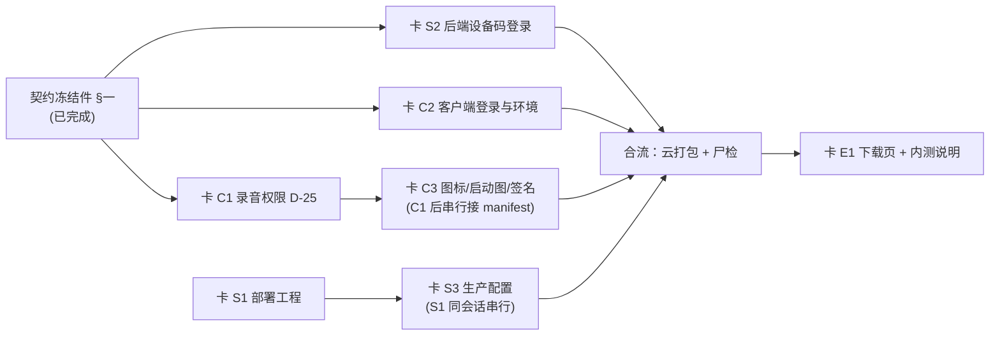

# 内测下发 · 并行任务卡母版（阶段2 后端上云 ∥ 阶段3 客户端改造）

> 生成：2026-09-21 ｜ 用途：**分发给独立会话/Agent 执行的任务卡母版**（配 `docs/服务器规格核算_20260921.md`）
> 拍板前提（2026-09-21 峰宝）：登录＝**设备码免输入自动建档** · 存储＝**COS** · 规格＝**8核16G/60G/5Mbps** · 打包＝**本轮改造后一次云打包**
> 收口：主窗口负责契约冻结复核、逐卡 Review、串行编译门、云打包、五处同步（Agent 不执行 git 写命令）

---

## 〇、通用铁律（七张卡共同遵守，**任何一张不得豁免**）

### G1 工作树与 git 冻结
- 一切读写只在**主仓 `D:/GuangH-App`，`develop` 分支**。`git worktree list` 现仅主仓（`.wt/*` 全部已收口删除），**禁止新建 worktree**（除非主窗批准）。
- **git 全操作冻结**：禁止 `add / commit / push / pull / checkout / restore / stash / branch`。改完把改动留在工作区，**报告改动文件清单**，由主窗验收后统一提交（各卡独立 commit）。
- 允许的只读命令：`git status`、`git log`、`git show`、`git diff`、`git ls-files`、`git cat-file -e`。
- **「已修」宣称必须含 git 入库存在性检查**（本仓已因「已修但从未入库」栽过三单：D-02/D-03、文案库 v1、U3/D4 弹窗链）——报告须写明新增文件是否已被 `git ls-files` 看到。

### G2 环境地雷（本机实锤过两次）
- 对 `client/` 做**任何 git 写操作**后，本机（疑 Defender 行为监控）可能批量删 `client/` 下文件（显示为 ` D`）→ 立即 `git status --short | Select-String '^ D'`，若 >5 行执行 `git checkout HEAD -- client` 恢复（零损失）。
- 建议用户把 `D:\GuangH-App` 加入 Windows 安全中心排除项（根治）。
- PowerShell 三坑：`stash@{0}` 花括号被吞（单引号包裹）；内联 `python -c` 带引号必坏（**一律写 .py 文件再跑**）；**同一消息对同一文件发两个写操作**（禁令）。

### G3 文件白名单制（最高优先级）
- 每卡列出的「允许修改文件」之外，**任何文件一个字节都不许改**（含 `pages.json`、`client/utils/api.uts`、`backend/app/**` 他人域）。
- 跨卡共享文件（`client/manifest.json`）**单写者制**，交接必须串行（见 §四 矩阵）。
- 白名单内也要克制：只改与任务直接相关的区块，**不动他人已完成实现**。

### G4 uvue / UTS 零先例禁令
写任何不确定语法前必须先在项目内 Grep 到先例，否则**先查官方文档**，仍无则降级 + 登记台账：
1. 禁 `!.` 非空断言；2. 禁 type 字面量构造（对象一律 `class + constructor + new`）；3. 禁函数默认参数 `= []`；4. 禁 CSS 复合/后代选择器与伪类；5. `v-for` 必带 `:key`，ref 数组更新用下标重建（禁 splice）；6. 弹层用 `v-if` 卸载复位（禁 defineExpose）；7. 只用项目里已出现过的 uni API；8. 组件放 `client/components/<名>/<名>.uvue`（easycom 自动注册）。

### G5 门禁（不可绕）
- 提交前：`python scripts/review_agent.py`（快速门禁）；**完成声明前**：`python scripts/review_agent.py --full`（全量，含 pytest + 密钥扫描 + 覆盖率阈值 50%）。
- 任何门禁失败必须先 `python scripts/lessons.py add --error ... --root-cause ...` 才能过下一枚提交（`review_agent` 强制）。
- `git config core.hooksPath .githooks` 已装；**`--no-verify` 禁用**。

### G6 密钥纪律
外部 Key / 凭证只经 Infisical（`skills/infisical-secrets/SKILL.md`：`infisical secrets --env=dev`、`infisical run --env=dev -- <cmd>`），**永不硬编码、永不提交、永不在报告/聊天中回显值**。新增 `.env` 类文件必须确认被 `.gitignore` 覆盖（用 `git check-ignore -v` 验证）。

### G7 真机证据铁律
无 nova 11 实测三要素（型号+时间 / 截图或日志 / 判定）不得宣称真机打通；缺前置只能写「待补」。**权限是否真的生效，唯一证据是云打包产物的 aapt / dex 尸检**（标准调试基座用基座自身 manifest，项目 manifest 权限不生效——本地跑通不算）。

### G8 云打包单队列
**禁止并发打包**（`cli.exe pack` 单队列，并发互杀）。出包命令：
```powershell
& "D:\HBuilderX\cli.exe" pack --project "D:\GuangH-App\client" --platform android --iscustom true --android.packagename com.yishu.guanghua --ignoreWarnings true
```
`--ignoreWarnings` 需**显式布尔值**；产物落 `client/unpackage/debug/`。尸检用 python 全 dex 扫（**别用 findstr**，08-28 误录教训）：
```powershell
python -c "import zipfile;z=zipfile.ZipFile(r'<apk路径>');b=b''.join(z.read(n) for n in z.namelist() if n.endswith('.dex'));[print(p, p.encode() in b) for p in ['yishuRecorder','RecorderController','yishuPhotoWatch','DataSyncService']]"
```
aapt 查权限与 service：`aapt dump xmltree <apk> AndroidManifest.xml`。

### G9 平台口径与纪律
- 交付文档 `忆述光华_交付文档/` **只读**，修改需用户明确同意。
- 改任何**全局数字**必须五处同步：`AGENTS.md` + `08 文档`（需授权）+ `progress.md` + `session-handoff.md` + `feature_list.json`；决策/口径变化登记 `docs/决策台账.md`。
- 命名约定：写「开发 Wave n」「收尾 Wave n」「4b 修复批次 批次 n」；「F 前缀」三族（功能 F1–F9 / 远期待办 F1–F7 / 真值 A–G 批）引用必须带族名。
- 客户端改动前先读 `skills/hbuilderx-uniappx-runloop/SKILL.md`；真机链读 `skills/android-media-e2e/SKILL.md`。
- **绝不 push**（origin 同步归用户）。

### G10 报告格式（三段式，缺一不可）
```
① 改动文件清单（逐个 + 改了什么 + 是否已被 git ls-files 看到）
② 验证命令与结果（原文粘贴输出关键行；未跑的命令写「未跑」+ 原因）
③ 未闭环项 / 风险 / 待拍板
末行声明：未执行任何 git 写操作 ｜ 未 push ｜ 未绕门禁（按卡要求补「未跑编译 / 未碰 adb」）
```

---

## 一、契约冻结件（并行前提，**已冻结，不得单方改动**）

阶段2 与阶段3 唯一的耦合点是「登录端点的形状」。本件即冻结产物，**两端并行按此实现**；任何一方需要改动，必须回到主窗重新冻结并通知另一方。

```python
# backend/app/schemas/auth.py（新增）
class DeviceLoginRequest(BaseModel):
    device_id: str = Field(..., min_length=1, max_length=64)   # 长度对齐既有 WechatLoginRequest.device_id
    platform: str = "android"
    app_version: str | None = None

# POST /api/v1/auth/device  ->  ApiResponse[TokenPair]   （响应结构与 /api/v1/auth/wechat 完全同构）
# 身份映射：AuthIdentity(unionid=f"device:{device_id}", device_id=device_id, platform=platform)
# 门控（fail-closed）：settings.allow_device_login=False → 501 AUTH_014
#   语义对齐既有两条：微信未配 → 501 AUTH_011（providers.py:324）、短信未接入 → 501 AUTH_010（providers.py:80）
# 限流：沿用 auth 域既有 IP/用户双维限流，不新增阈值
# 复用：auth.py:214 _finish_login → :220 _get_or_create_user（IntegrityError 回滚重查）→ :256 _issue_tokens
```

```uts
// client/utils/contract.uts（新增登记）
export const PATH_AUTH_DEVICE: string = '/api/v1/auth/device'
```

**冻结理由（已核实，含 2026-09-21 code-explorer 独立复核）**：`User.unionid` 为 `String unique` 且**无长度上限**（`backend/app/db/models/auth.py:18`），可承载 `device:<id>` 伪身份；`_finish_login`/`_issue_tokens` 已覆盖建档、并发唯一约束兜底、devices 表 refresh 哈希与轮换——新通道只需实现 `LoginProvider.resolve_identity`，**改动面与回归面最小**。错误码 `AUTH_014` 为当前唯一空位（既有 AUTH_001/003/004/005/010/011/012/013/099，见 `backend/app/core/errors.py:36-114`）；**新增码必须先登记 `_ERROR_SPECS` 再引用常量**——校验执行者现为 **`backend/tests/test_error_registry.py:70-76`**（AST 扫全 `backend/app/**` 的 raise 点，未登记即红）。⚠️ **本卡早期误引 `test_techdebt_p0`：该文件已按域拆分、当前不存在。**

**复核确认的两条纪律**：① **分发点唯一**——`get_login_provider` 全仓只有 1 处定义（`providers.py:332`）+ 2 处调用（`auth.py:56,66`），**`device_login` 必须经 `get_login_provider("device")` 取 provider，禁直接 `DeviceLoginProvider()` 实例化**（否则新增分发分支被绕过）；② `device_id` 在既有代码中**从不是用户身份**（仅 sync 游标 `models/sync.py:16-20`、事件来源标签 `events/sync.py:107`），且代码层**零 `'device:'` 前缀硬编码**，新通道与既有语义无冲突。

---

## 二、波次与依赖



**可并行关系（文件域零交集）**：
- **轨 A**：卡 S1 → 卡 S3（同会话串行，独占 `deploy/**` 除 `deploy/download/**`）
- **轨 B**：卡 S2（独占 `backend/app/**` 认证域 + `backend/tests/**` + `docs/openapi.json`）
- **轨 C**：卡 C1（独占 `client/manifest.json` + `yishu-recorder` + `client/utils/voice.uts`）
- **轨 D**：卡 C2（独占 `client/utils/{config,auth,contract}.uts` + 新建 `client/utils/device_id.uts` + `client/pages/settings/settings.uvue`）
- **轨 E**：卡 E1（独占 `deploy/download/**`，可即时开工，产物地址待 C3 出包后填）

**必须串行的三处**：① C1 → C3 的 `manifest.json` 单写者交接；② S1 → S3 的 `deploy/` 同目录接力；③ 全部改动就位后**由主窗串行**跑编译门与云打包（禁并发）。

---

## 三、任务卡

### 卡 S1 · 部署工程（轨 A 第一步）

**目标**：从零建 `deploy/` 部署工程——三个依赖服务容器化、后端镜像、进程托管、模型预置、健康自证、幂等启动。仓库当前**无任何 Dockerfile / docker-compose**（已全仓核实零命中）。

**前置**：无（可即时开工）。

**允许修改/新建**：
- `deploy/**`（**新建**；但 `deploy/download/**` 归 E1，禁碰；`.env.production.template` / `RUNBOOK.md` / `backup_pg.sh` 归 S3，本卡只在需要时留占位不写内容）
- `.gitignore`（**仅追加** `deploy` 下需忽略的行，如 keystore / 数据卷目录；禁止改动其他现有行）

**禁止触碰**：`backend/app/**`（S2 域）、`backend/tests/**`、`client/**`、`docs/openapi.json`、交付文档。

**实施要点**：
1. `docker-compose.yml`：`pgvector/pgvector:pg16`（**pgvector 扩展由镜像 + `CREATE EXTENSION vector` 提供**，`requirements.txt:18-19` 已注明 python 侧不装）+ `redis:7`（AOF 开启）+ `qdrant`；**端口一律绑 `127.0.0.1`**（5432/6379/6333 不对公网）；写内存上限与健康检查；数据卷落独立目录。
2. `Dockerfile.backend`：`python:3.11-slim` + `backend/requirements.txt`；模型资产**以挂载/预置方式进容器**（不烘进镜像，避免镜像膨胀到数 GB）。
3. `systemd/`：`yishu-api.service`（`uvicorn --workers 1`，**不得加 workers 数**——每进程多一份 BGE-M3 ~1.2G）+ `yishu-worker.service`（`python -m app.workers.worker`，**生产 Linux 走完整模式含 scheduler**；dev Windows 的无 scheduler 形态仅本地用，决策台账 §2.6）。
4. `scripts/bootstrap.sh`（幂等）：建目录 → `docker compose up -d` → 等健康 → `alembic upgrade head` → **迁移后断言目标表存在** → 打印下一步。迁移口径：**生产增量以 alembic 为准，CI 建库以 `schema.sql` 为源，两者不得混用**（决策 §2.5）。
5. `scripts/pull_models.sh`（幂等）：SenseVoice 走仓内既有入口 `backend/scripts/prepare_sensevoice.py`；BGE-M3 走 `scripts/warm_hf_models.py`（**该脚本会强制 `HF_HUB_OFFLINE=0` 下载，生产运行前须确保缓存就位**；运行时 `embedding.py:20` 默认 `HF_HUB_OFFLINE=1` 离线加载）；SetFit 就位校验 `backend/models/setfit-classifier/model.safetensors` 存在（缺失会静默降级 `mixed`，见 `classifier.py:43-53`）；reranker 3.2G **不下载**（`RERANK_ENABLED=false`）。
6. `scripts/healthcheck.sh`：`curl /healthz`（须 `{"status":"ok"}`）+ 三依赖服务连通 + DB 连通，三连自证。
7. `scripts/deploy_one.sh`：单命令幂等部署（沿用项目既有同名脚本习惯）。
8. **不得放大** `SEARCH_CONCURRENCY`（4）与 DB 池（5+10）——它们是 P0-2 性能修复的既有护栏。

**验收**：
- `docker compose config` 语法合法；
- `bash deploy/scripts/healthcheck.sh` 三连通过；
- `bootstrap.sh` / `deploy_one.sh` **重复执行幂等**（不产生重复进程、不重复迁移）；
- 报告给出 `git ls-files deploy` 输出（证明新文件已在索引）。

---

### 卡 S3 · 生产配置与部署就绪包（轨 A 第二步，**S1 同会话串行**）

**目标**：产出生产变量模板 + 上机手册 + 定时备份，并**恢复**（非重写）部署就绪包。

**前置**：S1 完成。

**允许修改/新建**：`deploy/.env.production.template`、`deploy/RUNBOOK.md`、`deploy/scripts/backup_pg.sh`、`docs/部署就绪包_20260921.md`（新建）。

**⚠️ 恢复优先（不得从零重写）**：`docs/部署就绪包_20260828.md` 曾于 commit `175de68` 提交（177 行，含 `.env.production` 模板 + 部署检查清单），但**不在 HEAD**（`git cat-file -e HEAD:<path>` 已实测 fatal）。取基线：
```powershell
git show 175de68:docs/部署就绪包_20260828.md > docs/部署就绪包_20260921.md
```
在此基础上更新（补本次新增项：`ALLOW_DEVICE_LOGIN`、`STORAGE_BACKEND=cos`、`SENSEVOICE_MODEL_DIR`、`MEDIA_URL_SECRET`、规格实测表引用）。同期确认另两份失联资产是否需要一并恢复：`docs/压测报告_20260828.md`（`277b7ac`）、`docs/parallel-dev-收尾/20_内测包构建配置清单.md`（多处引用但 HEAD 无）。

**实施要点**：
1. `.env.production.template` 与 `backend/app/core/config.py` 字段**逐一对齐**，**零真实 key、全占位**。必配项：`APP_ENV=production`、`JWT_SECRET`、`REFRESH_TOKEN_HMAC_KEY`、`MEDIA_URL_SECRET`（三者**互相独立**的强随机值）、`DATABASE_URL`/`REDIS_URL`/`QDRANT_URL`、`DASHSCOPE_API_KEY`+`DASHSCOPE_WORKSPACE_ID`、`SENSEVOICE_MODEL_DIR`、`STORAGE_BACKEND=cos`+COS 五项（`COS_BUCKET`/`COS_REGION`/`TENCENT_SECRET_ID`/`TENCENT_SECRET_KEY`/`TENCENT_APPID`）、`ALLOW_DEVICE_LOGIN=true`（内测期）、`MOCK_EXTERNAL_AI=false`、`CORS_ORIGINS`。
2. **RUNBOOK 必写**：`APP_ENV=production` 会因 `JWT_SECRET`/`REFRESH_TOKEN_HMAC_KEY` 为默认值**直接抛错启动失败**（`config.py:201-230`，期望行为）→「**先配密钥再启动**」；并写清 `MOCK_EXTERNAL_AI` 被强制 false 的告警含义。
3. 定时任务：**22:00 `daily_review.py` 走系统 cron（幂等，不进代码调度）**（决策 §2.6）；备份：每日 `pg_dump -Fc` + WAL 归档 + **非空校验 + 失败告警**（RPO ≤24h / WAL ≤5min）。
4. RUNBOOK 内嵌 `docs/服务器规格核算_20260921.md` §7 的**实测校验表**（8 项），上机后回填。

**验收**：模板字段与 `config.py` 的差异清单为空（建议写个一次性比对脚本，跑完删除）；`git ls-files` 确认四个新文件入库；密钥扫描（`review_agent` 内建）零命中。

---

### 卡 S2 · 后端设备码登录通道（轨 B）

**目标**：实现冻结件 §一 的 `POST /api/v1/auth/device`，让 20 台设备首次打开即各自建档、互不串数据；门控 fail-closed。

**前置**：契约冻结件 §一（已冻结）。

**允许修改/新建**：`backend/app/api/auth.py`、`backend/app/services/auth/providers.py`、`backend/app/services/auth/auth.py`、`backend/app/schemas/auth.py`、`backend/app/core/config.py`、`backend/app/core/errors.py`、`backend/tests/test_auth_device.py`（新建）、`docs/openapi.json`、`docs/OpenAPI契约.md`。

**禁止触碰**：`client/**`、`deploy/**`、`backend/app/db/models/**`（**本轮不动 Schema**）、其他 `backend/app/services/**`。

**实施要点**：
1. `config.py` 增 `allow_device_login: bool = False`（**默认 False**，注释写清「内测期临时通道，默认关闭防任意设备自助注册后门」；语义与 fail-closed 文化一致）。
2. `errors.py`：先登记 `ErrorSpec("AUTH_014", "设备登录未开启（内测通道）", 501)`，再加常量 `ERR_AUTH_014`（**顺序不可反**）。
3. `providers.py` 增 `DeviceLoginProvider`：`resolve_identity` 在门控关闭时 `raise ApiError(ERR_AUTH_014, ..., http=501)`；开启时返回 `AuthIdentity(unionid=f"device:{req.device_id}", device_id=req.device_id, platform=req.platform)`；`get_login_provider` 增 `"device"` 分支。**`device_id` 需 strip + 空值拒绝**（422/AUTH_001 按现有风格择一并在报告说明）。
4. `auth.py` 增 `device_login(db, req)` → `_finish_login`（**不复制**建档/签发逻辑）。
5. `api/auth.py` 增 `POST /device`（`:40` 风格对齐 `wechat_login`）。
6. 测试（至少 5 例）：门控关 → 501 且码为 AUTH_014；门控开 → 200 + `TokenPair` 结构完整；**同 `device_id` 二次登录幂等**（同 `user.id`，devices 行不重复）；**异 `device_id` 严格隔离**（不同 `user.id`，且 A 的 token 查 B 的资源 404）；空/超长 `device_id` → 422。
7. `docs/openapi.json` 再生（**只增不减**，报告须给「路径数 before→after」；当前基线 47 路径，新增后应为 48）。

**验收**：`pytest backend/tests/test_auth_device.py -v` 全绿 + `pytest -m "not slow and not rag"` 无回归 + `python scripts/review_agent.py --full` 退出码 0；openapi diff 仅新增。

---

#### ⚠️ 卡 S2 复核补正（2026-09-21 · code-explorer 独立复核，**优先于本卡上文**）

| # | 上文写法 | 补正后 | 证据 |
|---|---|---|---|
| 1 | 白名单未含 `__init__.py` | **白名单追加 `backend/app/services/auth/__init__.py`**（`:25` import、`:46` `__all__` 需登记新 provider，否则导出缺失） | `services/auth/__init__.py:25,46` |
| 2 | 要点 2 引 `test_techdebt_p0` | 实为 **`backend/tests/test_error_registry.py:70-76`**；`test_techdebt_p0.py` 已按域拆分、**文件不存在** | 同上 |
| 3 | 要点 3 未约束 provider 获取方式 | `device_login` **必须走 `get_login_provider("device")`**；全仓分发点唯一（定义 `providers.py:332`、调用 `auth.py:56,66`），`backend/tests/**` 中 `get_login_provider` **零命中**（无测试锁分发，写错不会被测试兜住） | 复核 §1 |
| 4 | 未约束端点签名 | **必须用 `DeviceLoginRequest` schema，禁用裸 `device_id: str` 形参**——`test_authz_gate.py:122-124` 把「形参名以 `_id` 结尾」判为归属校验候选，裸形参会让 `:175-197` 的断言失败（CI 红） | `test_authz_gate.py:122-124,166-172,175-197` |
| 5 | 要点 7 / 验收写「基线 47 路径」 | **基线以实测为准**：`docs/OpenAPI契约.md:28,30` 写 46、本卡上写 47，**两处口径互相冲突** → 实施时先实测路径数，报告给「实测 before→after」，并**同步更新 `docs/OpenAPI契约.md`** 的路径数与认证域表（`:32-39`） | `OpenAPI契约.md:12-17,24,28,32-39` |
| 6 | 未给契约再生命令 | openapi **无专用脚本**，再生命令（在 `backend/` 下执行）：`python -c "import sys; sys.path.insert(0,'.'); from app.main import app; import json; json.dump(app.openapi(), open('../docs/openapi.json','w',encoding='utf-8'), ensure_ascii=False, indent=2)"`；「路径数只增不减」是**人工流程门禁、无自动化测试**（`review_agent.py` 不含 openapi 检查） | `OpenAPI契约.md:12-17` |

**复核确认「无需处理」**：① 无任何「以 `device_id` 为用户身份」的既有实现或半成品；② 错误码真源唯一（`_ERROR_SPECS`），前端 `contract.uts` 与 `docs/OpenAPI契约.md` 均**不自列码表**，无需同步；③ 无断言端点总数 / provider 数 / openapi 路径数的测试（唯一下界哨兵为 `test_authz_gate.py:166-172` 的 `>=20`，新增端点不会触发）。

---

### 卡 C1 · 录音权限补全（D-25 / D-26）（轨 C）

**目标**：让云打包 APK 里**真的**有 `RECORD_AUDIO` 且运行时会申请——否则录音链路必挂（D-25）。

**背景（登记处，非新问题）**：`_diff_ledger.md:2208-2211` RC-4 ——「全仓零运行时权限申请范式（`uni.authorize`/`requestSystemPermission`/`RECORD_AUDIO` 全部零命中）……`RECORD_AUDIO` 同为 `granted=false` → 录音链路大概率同款死法（未验，待单独排查）」→ **登记为 D-25**；`POST_NOTIFICATIONS` 动态申请 → **D-26**。

**前置**：契约冻结件 §一（不阻塞，仅通知）。

**允许修改**：
- `client/manifest.json`（**本轮唯一写者**，改完交接给 C3）
- `client/uni_modules/yishu-recorder/utssdk/interface.uts`、`client/uni_modules/yishu-recorder/utssdk/app-android/index.uts`
- `client/utils/voice.uts`（**仅**权限前置接线）
- `client/AndroidManifest.xml`（**仅在**核实后确有必要时追加权限；该文件是云打包唯一合并点）

**禁止触碰**：`client/utils/auth.uts`、`config.uts`、`contract.uts`（C2 域）、`pages/**`、`backend/**`。

**实施要点**：
1. `manifest.json` **两处权限块都要补**（`:20-25` `app.distribute.android.permissions` 与 `:36-41` `app-android.distribute.permissions`）：
   `<uses-permission android:name="android.permission.RECORD_AUDIO"/>`。
   同时**核实** `POST_NOTIFICATIONS` / `FOREGROUND_SERVICE*` 是否需要在此同步声明（当前仅在工程根 `client/AndroidManifest.xml:21-24`）——把结论写进报告，**不要凭感觉加**。
2. 复用相册插件的既有范式，**不要新造**：`yishu-photo-watch/utssdk/app-android/index.uts:398-420` 的 `PermissionRequest`（**保证回调恰好一次**，覆盖已授予/授予/拒绝/永久拒绝/抛异常五路径）+ `:506-541` 的 `requestReadPermission(callback)`（`UTSAndroid.getUniActivity()` 取 Activity）。
   ⚠️ **2026-09-21 侦察更正（原卡写作有误，勿照旧文执行）**：**不要新增任何请求码常量**——相册插件里那个 `REQ_READ_MEDIA=2001`（`index.uts:30`）是**全仓零使用的死常量**。结果回传由框架代管：`UTSAndroid.requestSystemPermission(activity, perms, success, fail, shallUnCheck)` 内部完成 `requestPermissions` + `onRequestPermissionsResult` 匹配后分发到 success/fail 回调，业务侧既拿不到也不需要请求码。在 `yishu-recorder` 增：
   - `interface.uts`：`requestRecordPermission(callback: PermissionResultCallback): void` + `isRecordPermissionGranted(): boolean`（**注意该插件文件头既有约束**：不在 `app-android/index.uts` 里 `export * from '../interface.uts'`，函数按同名实现 + 类型具名再导出——重复导出曾触发编译器 overload panic）
   - `app-android/index.uts`：照搬五路径范式实现
3. 接线点：`client/utils/voice.uts:131 startRecord()` **之前**做权限前置；拒绝 → **诚实 toast + 不启动**（**禁静默**，违反即 D-24 同类缺陷）；不得破坏 `photoWatch.setRecordingActive(true/false)` 的 microphone/dataSync 互斥链路。
4. **D-26（POST_NOTIFICATIONS 动态申请）本轮只出结论、不实施**——既有裁决：归属通知体系、塞进相册插件是职责污染（`_diff_ledger.md:2285`）。报告写明「D-26 维持挂账」。

**验收**：
- 本地**全量**编译门通过（`cli` 编译须 `--cleanCache` 全量——增量 warm cache 会掩盖存量错）；
- **云包产物 aapt 尸检**：`aapt dump xmltree <apk> AndroidManifest.xml` 含 `RECORD_AUDIO`（**这是权限生效的唯一证据**；标准调试基座用基座自身 manifest，本地跑通不算）；
- 真机（nova 11）：点录音 → 弹系统授权框 → 授予 → 录一段 → 转写返回文本；拒绝路径出现诚实提示且不静默。

---

### 卡 C2 · 客户端登录与生产环境（轨 D）

**目标**：把「假占位环境 + mock 登录」换成真实生产地址 + 设备码登录，让 20 台设备各自独立账号；并补上退出登录入口。

**前置**：契约冻结件 §一（已冻结）。

**允许修改/新建**：`client/utils/config.uts`、`client/utils/auth.uts`、`client/utils/contract.uts`、`client/utils/device_id.uts`（新建）、`uni_modules/yishu-device-id/**`（新建插件，落点决策见文末「C2 执行更正」）。**追加白名单（2026-09-21 执行时发现必须一起改，否则复现"device_id 双源分裂"事故）**：`client/utils/sync_client.uts`、`client/utils/event_sync.uts`（原 import `auth` 的 `DEVICE_ID` 常量，共 3 处）。~~`client/pages/settings/settings.uvue`~~ —— **已撤销**（退出登录早已接线，见文末更正）。

**禁止触碰**：`client/manifest.json`（C1 域）、`client/utils/voice.uts`、`client/utils/api.uts`、`pages.json`、`backend/**`。

**实施要点**：
1. **设备唯一标识（最大不确定项，官方文档已定案）**：
   - 官方 `uni.getDeviceInfo()` **有 `deviceId` 字段，但文档明载「由 uni-app 框架生成并存储，清空 Storage 会导致改变」**（https://doc.dcloud.net.cn/uni-app-x/api/get-device-info.html）→ **不可单独用作账号身份**（清缓存即变新号，本仓历史上已有「静默创建全新空用户 → 极易误判数据丢了」的实锤，见 `_resource_endpoint_matrix.md` §八）。
   - **采用方案（顺序）**：**主 = UTS 插件读 `Settings.Secure.ANDROID_ID`**（稳定；同签名 key 重装/清缓存不变；`yishu-photo-watch` 已有 `appContext()`/`UTSAndroid.getUniActivity()` 先例可复用；可新建 `yishu-device-id` 插件，或经主窗批准并入 C1 的插件改动——**落点需与主窗确认后动手**）；**兜底 = `uni.getDeviceInfo({filter:['deviceId']})` + 本地 storage 持久化**；**禁用**「客户端自造 UUID 存 storage」。
   - **若 ANDROID_ID 路线受阻**：**挂起本卡并回报主窗**，不得静默降级为 framework `deviceId` 而不告知（那会引入「清缓存丢号」故障模式）。
   - `client/utils/device_id.uts` 契约：导出 `getDeviceId(): string`（同步优先、失败返回空串并不抛）+ 取值来源常量（便于日志与排障）；首次取值打点 `console.log('[yishu] device_id source=...')`。
   - **隐私合规待办（只登记，不改隐私政策正文）**：ANDROID_ID 属设备标识，须在隐私政策「收集的设备信息」条款中声明 → 写入 `docs/决策台账.md` 待办。
2. `config.uts`：`ENV` 改 `'prod'`；`PROD_BASE_URL` 换真实地址 `http://<公网IP>:8010`（具体 IP 由用户/主窗提供，**报告里不得回显任何密钥**）；`REAL_DEVICE_HOST` 清空为 `''`；`DEV_PAGE_ENABLED` 由 ENV 派生自动关闭（**无需手改**，见 `config.uts:31-34`）。
3. `auth.uts`：
   - 删除 `code:'dev-client'` 硬编码（`:78`），新增 `deviceLogin()` → POST `PATH_AUTH_DEVICE`，请求体 `{device_id, platform:'android', app_version}`；
   - `ensureLogin()`（`:120`）与 `doRefresh()` 的降级重登（`:175-181 fallbackLogin`）改调 `deviceLogin()`；
   - **保留**既有看门狗（10s/8s）与 single-flight 语义（G1/R6#6 成果不得回退）；`DEVICE_ID` 常量改为从 `device_id.uts` 取值（**去掉硬编码 `'yishu-android-dev'`**）。
   - 技术债登记不修：`auth.uts` 三个请求走裸 `uni.request`（未走 `api.uts`）为历史既知债（`_resource_endpoint_matrix.md` §八），本轮**只登记不在本卡修**。
4. `contract.uts`：登记 `export const PATH_AUTH_DEVICE: string = '/api/v1/auth/device'`。
5. ~~`settings.uvue`：在**组2**追加一行「退出登录」~~ —— **2026-09-21 执行时证伪，已撤销该条**（见文末「C2 执行更正」第 1 条）。**不要重复造登出入口。**

#### ⚠️ C2 执行更正（2026-09-21，实测证据，优先于上文）

| # | 上文写法 | 更正 | 证据 |
|---|---|---|---|
| 1 | 「`logout()` 已有但零调用，在 settings 补入口」 | **失效**：退出登录**早已落地并接线**（W10 波次，晚于 08-31 那份旧矩阵快照）→ 不再动 `settings.uvue`，否则会造出两个语义相同的入口 | `client/pages/account/security.uvue:44-48`（画布 41:200 组）+ `:113-126`（`onLogout` → `logout()` → `reLaunch`） |
| 2 | 「新增请求码/只加 `device_id.uts`」 | **白名单外扩 2 文件**：`sync_client.uts` + `event_sync.uts` 仍 import `auth` 的 `DEVICE_ID` 常量；不一起改会让"登录用真设备 id、同步用旧常量"→ 复现本仓记载的"device_id 分裂"事故 | `sync_client.uts:31,313,448`；`event_sync.uts:14,41` |
| 3 | 「ANDROID_ID 插件落点待定」 | **已定：新建独立插件 `yishu-device-id`**（理由见 `docs/决策台账.md` §2.18） | 本卡文件域矩阵同步更新 |
| 4 | 未提及 | **新增出包前置静态门**（已写入卡 C3）：`grep "export const ENV" client/utils/config.uts` 必须为 `'prod'`、`PROD_BASE_URL` 必须已替换真实地址——`ENV` 是为真机联调临时切 `'dev'` 的开关，最易漏改 | 卡 C3 §实施要点 4 |

**验收**：
- `ENV='prod'` 构建下真机冷启动 `ensureLogin` 成功；两台设备拿到**不同** `user.id`（报告用 id 前缀对比，**不得贴 token**）；
- **同机清缓存/重装后重登仍是同一 `user.id`**（ANDROID_ID 稳定性专项验证——这是本卡最关键的一条）；
- 退出登录 → 再次进入能重新登录且数据仍在；
- 本地编译门通过 + 真机日志含 `[yishu] device_id source=...`。

---

### 卡 C3 · 图标 / 启动图 / 自有签名（轨 C 第二步，**C1 之后串行接 `manifest.json`**）

**目标**：当前 `icons: {}`、`splashScreens.default: {}` 会显示默认图标；DCloud 公用调试证书不能正式分发且备案要填自有证书 MD5。

**前置**：C1 完成（`manifest.json` 单写者交接，**禁与 C1 并发**）。

**允许修改/新建**：`client/manifest.json`（**仅** `icons` 与 `splashScreens` 段）、`client/static/`（图标/启动图资源）、`.gitignore`（**仅追加** keystore 忽略行）。

**禁止触碰**：`client/manifest.json` 的 permissions 段（C1 成果，**一行不许动**）、其余 `client/**`、`backend/**`。

**实施要点**：
1. **自有签名证书**：`keytool -genkeypair` 生成 keystore → **用户保管**（**keystore 与密码绝不入库**；先 `git check-ignore -v` 验证忽略生效）；记录证书 **MD5**（备案要用）。
2. 补齐 `icons`（各分辨率）与 `splashScreens.default`；资源风格对齐项目基调（暖纸白 `#F8F7F4` / 品牌金 `#C4913C`）。
3. 把签名证书接入 HBuilderX 云打包配置；出包后 aapt 核对图标与签名。
4. **出包前置静态门（必跑，秒级——C2 遗留的翻转开关最易漏改）**：
   ```bash
   grep -n "export const ENV" client/utils/config.uts        # 必须命中 'prod'（真机联调临时改过 'dev' 就必须改回）
   grep -n "PROD_BASE_URL: string" client/utils/config.uts    # 不得再含「公网IP」占位
   grep -c "RECORD_AUDIO" client/manifest.json                # 必须为 2（两处权限块各一条）
   ```
   任一条不符**不得打包**——否则包发出去的现象是"所有页面全空且不报错"（`config.uts` 文件头已记载同源教训）。

**验收**：云打包出一枚**自有签名** APK；aapt 能看到新图标与 `RECORD_AUDIO`（与 C1 联合验收）；报告给出证书 MD5 的**存在性**说明（不贴私钥）。

---

### 卡 E1 · 内测下载页（轨 E，可即时开工）

**目标**：一张静态落地页，内测用户扫码/点链接即可下载 APK，并知道「怎么装、怎么反馈」。

**允许修改/新建**：`deploy/download/**`（新建）。

**禁止触碰**：其余 `deploy/**`（S1/S3 域）、`client/**`（**尤其是 `client/static/**`——见下方偏差登记**）、`backend/**`。

**技术规格**：静态 HTML + **独立 CSS 文件** + **零 JavaScript**；CSS 用 Tailwind CDN（`@import url('https://cdn.jsdelivr.net/npm/tailwindcss@2.2.19/dist/tailwind.min.css');`）+ CSS 变量定义色板；`` 必须带 `onerror` 兜底。

**设计规格（依计划书设计定位，不得自创风格）**：
- 色板：底 `#F8F7F4`／淡卡 `#F6EFE3`／白 `#FFFFFF`；品牌金 `#C4913C`、锈红 `#B05A3A`、深金 `#8A6A3A`；主文字 `#3A2E25`、次文字 `#6B5B4B`
- 字体：Sarasa Gothic SC（回退系统无衬线）；H1 40px/700、H2 20px/600、正文 16px/400
- 四区块：**① 品牌区**（左 App 名 + 内测版号 + 一句话价值说明；右图标浮起 + 柔和投影；底部品牌金→锈红细渐变线过渡）；**② 下载区**（主按钮「下载内测版 APK」品牌金实底 + 悬停上浮；旁侧二维码；按钮下补文件大小与更新日期 + 小字「仅限受邀内测用户」；整块淡卡面）；**③ 安装指引 + FAQ**（三步卡：允许安装未知来源 / 华为·荣耀先关「纯净模式」 / 首次打开授权麦克风与相册；窄屏纵排；下方折叠式 FAQ：安装失败、录不进声音、登录进不去）；**④ 反馈 + 内测须知**（左反馈入口群二维码或邮箱+一键复制，右须知：数据仅用于内测、可能丢失、请勿上传敏感内容；页脚备案号占位 + 隐私政策链接 + 版权，文字弱化）
- 响应式：移动端单列、桌面端两列；内容最大宽 ~960px 居中；**手机端一屏内必须能看到主按钮**；滚动渐显（尊重 `prefers-reduced-motion`）；微动效仅在 hover

**交付要求**：APK 下载地址与二维码先置**占位**，在 **C3 出包后**替换为真实地址（替换动作登记在报告，或退回主窗执行）。

**验收**：本地起静态服务 → 手机浏览器打开，主按钮一屏可见；随后由主窗用 **cloudStudio** 集成部署，拿公网地址。

---

## 四、文件域所有权矩阵（分发前自检，跨卡重叠＝0）

| 文件 / 目录 | S1 | S3 | S2 | C1 | C2 | C3 | E1 |
|---|---|---|---|---|---|---|---|
| `deploy/**`（除 download） | ✏️ 独占 | ✏️ 接力 | ⛔ | ⛔ | ⛔ | ⛔ | ⛔ |
| `deploy/.env.production.template`／`RUNBOOK.md`／`scripts/backup_pg.sh` | ⛔ | ✏️ 独占 | ⛔ | ⛔ | ⛔ | ⛔ | ⛔ |
| `deploy/download/**` | ⛔ | ⛔ | ⛔ | ⛔ | ⛔ | ⛔ | ✏️ 独占 |
| `backend/app/api/auth.py`｜`services/auth/**`｜`schemas/auth.py`｜`core/config.py`｜`core/errors.py` | ⛔ | ⛔ | ✏️ 独占 | ⛔ | ⛔ | ⛔ | ⛔ |
| `backend/tests/test_auth_device.py`｜`docs/openapi.json` | ⛔ | ⛔ | ✏️ 独占 | ⛔ | ⛔ | ⛔ | ⛔ |
| `client/manifest.json` | ⛔ | ⛔ | ⛔ | ✏️ **第一写者**（permissions） | ⛔ | ✏️ **第二写者**（icons/splash，串行） | ⛔ |
| `client/uni_modules/yishu-recorder/**`｜`client/utils/voice.uts` | ⛔ | ⛔ | ⛔ | ✏️ 独占 | ⛔ | ⛔ | ⛔ |
| `client/utils/config.uts`｜`auth.uts`｜`contract.uts`｜`device_id.uts` | ⛔ | ⛔ | ⛔ | ⛔ | ✏️ 独占 | ⛔ | ⛔ |
| `client/pages/settings/settings.uvue` | ⛔ | ⛔ | ⛔ | ⛔ | ✏️ 独占 | ⛔ | ⛔ |
| `client/AndroidManifest.xml` | ⛔ | ⛔ | ⛔ | ✏️ 条件独占 | ⛔ | ⛔ | ⛔ |
| `docs/服务器规格核算_20260921.md` | 📖 只读 | 📖 只读 | 📖 | 📖 | 📖 | 📖 | 📖 |
| `docs/部署就绪包_20260921.md` | ⛔ | ✏️ 独占 | ⛔ | ⛔ | ⛔ | ⛔ | ⛔ |

**跨卡共享契约（唯一）**：登录端点形状见 §一 冻结件——S2 实现、C2 消费，**双方不得单方改动**。

---

## 五、主窗口收口流程（Agent 不执行，仅备查）

1. 逐卡 Review（白名单越界即打回；`git ls-files` 核对新增文件已入库）。
2. 合并顺序建议：S2 → C1 → C3 → C2 → S1/S3 → E1（`manifest.json` 与 `deploy/` 的串行约束优先）。
3. **串行**跑编译门（一次只编一个改动集，`--cleanCache` 全量）→ `python scripts/review_agent.py --full` 退出码 0。
4. **云打包（单队列，禁并发）** + 产物尸检（aapt 权限/service + dex 探针）。
5. 真机冒烟（nova 11）：冷启动 → 自动建档 → 录音（弹权限框）→ 转写 → 搜索/时间轴有数据。
6. 收口登记：`docs/决策台账.md`（规格口径冲突 §6、内测登录通道、明文访问临时口径、ANDROID_ID 隐私条款待办、D-25/D-26 关单状态）→ 踩坑 `python scripts/lessons.py add` → **五处同步**（`AGENTS.md`/`progress.md`/`session-handoff.md`/`feature_list.json` + 08 文档需授权）。
7. 各卡独立 commit（pathspec 限定）→ 用户自行 push。

---

## 六、与计划书的偏差登记 + 待决项

| # | 项 | 处置 |
|---|---|---|
| **偏差-1** | 计划书 §五 目录树把下载页写在 `client/static/dist/` | 实际落 **`deploy/download/`**。理由：`client/static/**` 会被整体打进 APK（当前基座 63.1MB），且下载页必须**公网独立访问**、不能随包发布 |
| **偏差-2** | 计划书把 S1/S3 列为两张可分发卡 | 实际合并为**同一会话串行**（同占 `deploy/` 目录，避免同目录并发写） |
| 待决-1 | ANDROID_ID 路线的插件落点（新建 `yishu-device-id` 还是并入 C1 的 recorder 改动） | **C2 开工前需主窗确认**（避免与 C1 抢 `uni_modules` 域） |
| 待决-2 | `PROD_BASE_URL` 的真实公网 IP:8010 | 由用户/主窗在 C2 实施时提供 |
| 待决-3 | 是否一并恢复 `docs/压测报告_20260828.md` 与 `20_内测包构建配置清单.md` | 归 S3 顺带确认，不阻塞 |
| 风险-1 | 手机号登录（可跨设备找回账号）仍冻结在 501，设备码通道清缓存后依赖 ANDROID_ID 稳定性 | 已用 ANDROID_ID 主路线缓解；若兜底路线生效则存在「清缓存丢号」残留风险，须在 C2 报告中显式声明 |
| 风险-2 | C3 云打包与 4b 批次（D-06/D-07/D-08 等）共用单队列 | 本轮一次性打包（已拍板），4b 复验排在其后 |
