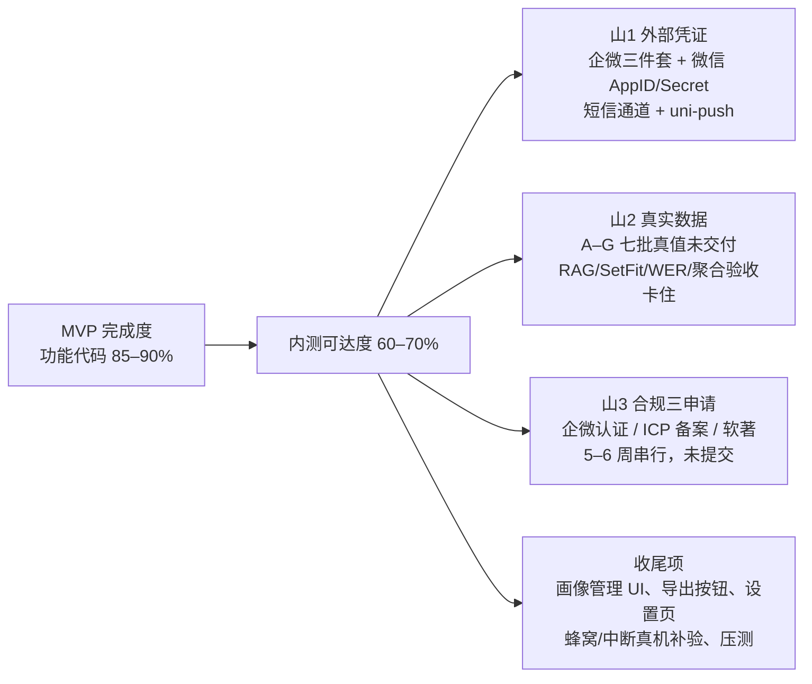
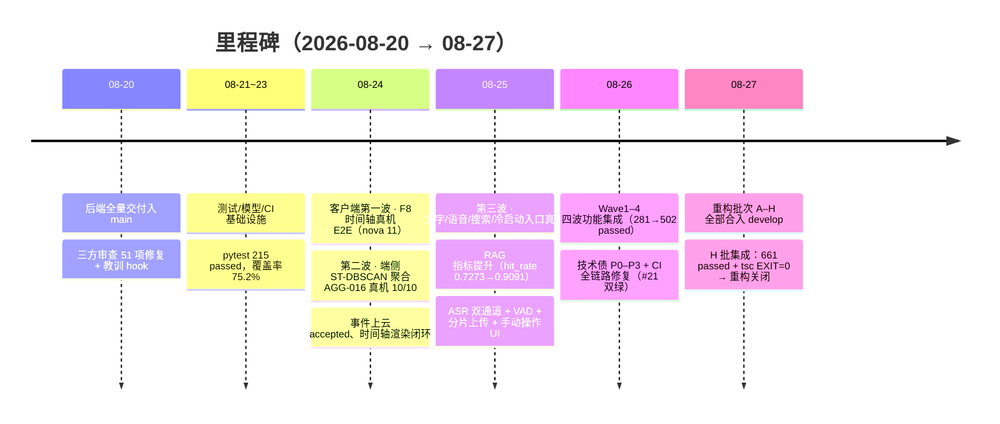
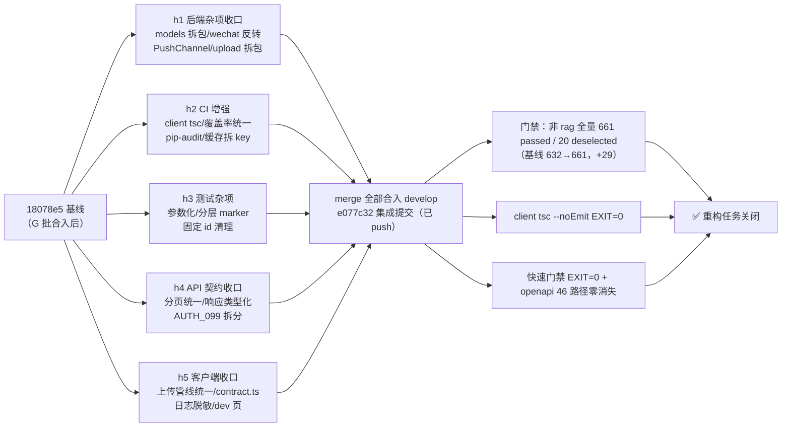
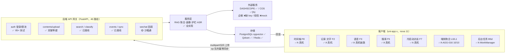
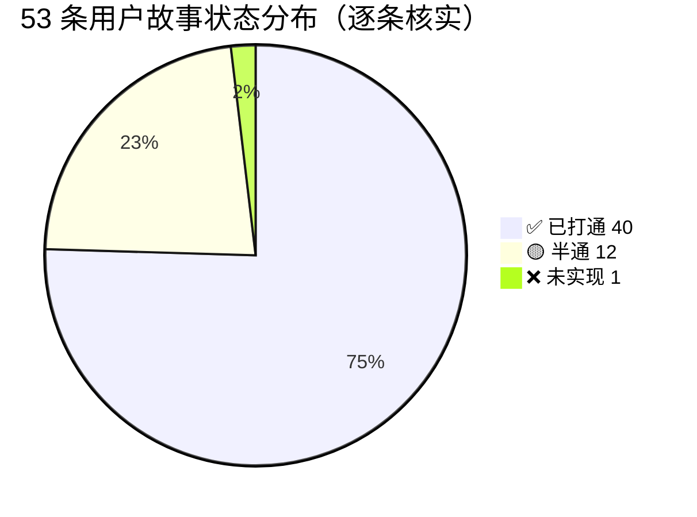
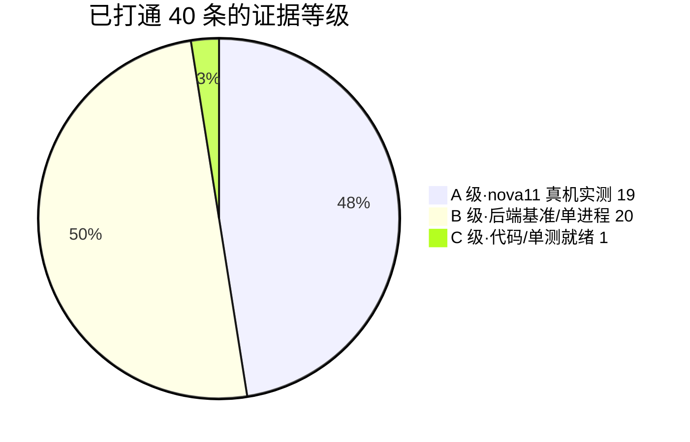
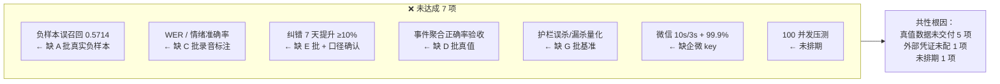
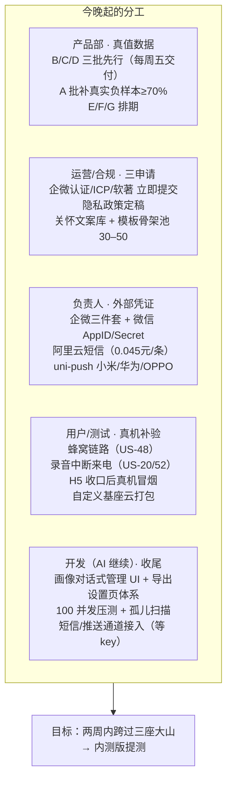

# 忆述光华 · MVP 晚间例会汇报（2026-08-27）

> **用途**：今晚 20:00 团队短会汇报材料（建议时长 15 分钟）
> **性质**：逐点事实核实的静态汇报（未改动任何代码）；报告撰写前已核对 git 主干、progress.md、feature_list.json、门禁产物与真机证据
> **证据纪律（最重要）**：git 历史说"打通"≠真机打通。本报告所有结论都标注**证据等级**——只有"在 nova 11 真机上实测通过"才写"已打通"；代码就绪/单元测试/后端基准一律如实降级标注。
> **配套文件**：同目录 00–06 六份评估报告（本报告为总汇报版，可交叉引用）

---

## 0. 一页结论

**一句话**：功能代码约 **85–90% 完成**（测试 661 passed、H 批重构已关闭、真机多链路已通）；距"可对外内测"约 **60–70%**，卡在三座大山：**外部凭证、真实数据、合规三申请**；另有少量 UI 收尾与真机补验。

**三个数字**：53 条用户故事 → ✅40 已打通（其中 19 条为真机 A 级）/ 🟡12 半通 / ❌1 未实现；性能门禁 18 项 → 已达标 9、部分达标 2、未达标 7；重构批次 A–H 全部合入 develop，**重构任务今日已关闭**。

---

## 1. 证据等级体系（怎么读这份报告）

| 等级 | 含义 | 判定规则 |
|---|---|---|
| ✅ **A** | nova 11 真机实测通过 | 有 progress.md 真机记录 + 截图/日志证据（.cowork-temp） |
| 🟡 **B** | 模拟器 / 单进程 / 后端集成基准 | 含 50 张单进程全链路、RAG 评测、api_smoke、CI 门禁 |
| ⚪ **C** | 仅代码/单元测试就绪 | 未在真机或实网验证，如蜂窝链路、录音中断、微信实网 |
| ❌ **D** | 未实现 | 无代码或明确缺口 |

> 铁律：**凡无 nova 11 实测记录，一律不得对外宣称"真机打通"**。"代码层打通"与"A 级真机打通"在汇报时必须区分。

---

## 2. 我们做了什么：08-20 → 08-27 全景

### 2.1 本周任务分组清单

| 主题 | 内容 | 成果证据 |
|---|---|---|
| 后端基线 + 审查修复 | 三方审查 51 项 checklist（P0 安全 7 + P1 技术债 17 + P2 架构 7） | 08-20 多提交 |
| 客户端三波 | F8 时间轴 → B3 端侧聚合/手动操作 → 文字/语音/搜索/冷启动入口 | 真机 nova 11 多轮 E2E（A 级） |
| 四波功能集成 | Wave1 B2 搜索+B5b 护栏 → Wave2 B3 云侧 → Wave3 B4 同步+B1 画像 → Wave4 B5a 语音+M3 微信+B5d 后台 | 281→312→341→420→467→502 passed |
| RAG 指标 | 类目路由/命中梯度/LLM 改写修复/外部测试集 | hit_rate@3 0.7273→0.8571→0.9091；P95 7629→2013ms |
| ASR 双通道 | Fun-ASR Flash 多格式 + SenseVoice 本地情绪 + VAD 长录音分段 | 真实 M4A 双通道验证（0.8741） |
| 技术债 P0–P3 | 安全/正确性 8 项 + 配置契约 + 性能（增量游标/N+1/索引）+ 死代码 + 依赖 CVE 升版 | 36+ 新测试 |
| CI 全链路 | #8–#21 七个根因（PG 竞态/schema 建库/pgvector/qdrant/HF 预热等） | CI #21 双绿 |
| 测试加固 | conftest 隔离/跨运行污染修复/条件轮询/共享 Redis 隔离 | 215 → 502 → 661 passed |
| 重构 A–H | 128 条机会侦察 → 8 批并行重构（行为等价、契约零消失） | H 批今日集成关闭 |
| 文档/harness | API 密钥清单、真值数据规格 v1、画像枚举集（L0 51 维 + L1 193 维）、OpenAPI 46 路径 | 均已入库 |

### 2.2 重构批次 H 关闭确认（今日重点）

- **git 证据**：`fd4268d merge(h1)` → `55cdfaa merge(h2)` → `a244839 merge(h5)` → `07b91f8 merge(h3)` → `01216c8 merge(h4)` → `e077c32` 集成提交；develop 已 push 且与 origin 同步。
- **门禁证据**：全量非 rag **661 passed / 20 deselected**；client tsc EXIT=0；快速门禁 EXIT=0；OpenAPI 重导 46 路径、errors 只增（AUTH_010-013/MSG_003）零删除。
- **遗留登记（不阻塞关闭）**：① H5 客户端收口后的 **HBuilderX 编译真机冒烟尚未补跑**（行为等价，属待验项）；② pip-audit-weekly 定时触发待 CI 观察；③ client tsc 为非阻断试点。
- **工作区残留（非代码）**：未提交的画像枚举集 L0/L1 精修中间产物（docs/_l0_refine_*.json、scripts/_merge_*.py）+ B1.md 设计文档修订（+40 行），建议集成后确认归档或清理。

---

## 3. 贡献分工：我（AI）与团队（人）

| 贡献方 | 做了什么 |
|---|---|
| **AI（我）** | Wave0–4 全部执行层（并行 Agent 开发/集成 B1–B5d 全模块）；技术债批次 A–H 八批重构；CI #8–#21 七个根因修复；测试 215→661；真机/模拟器验证脚本与证据沉淀；关键工程修复（跨用户检索污染、LLM 改写双路 bug、假完成状态、聚合 O(N²)→近线性、P95 7629→2013ms）；文档与 harness（密钥清单、真值规格、枚举集、OpenAPI 契约） |
| **团队（人）** | 仓库与后端全量基线（zqhmy1234 Initial / Geetie 3869111）；ASR 管线加固 PR（mohanarjun183，已 review 合入）；12+ 项产品/技术拍板（隐私红线、分类异步化、30min 保守开关、事件用户操作优先、STS 归口、短信 501 冻结、FinetuneJob 删除等）；nova 11 真机验收与设备支持（峰宝）、HBuilderX 环境、adb 隧道、Infisical 密钥注入；数据/规格要求（真值规格口径、枚举集、key 清单"必须写明白怎么获取"） |
| **协作机制** | 用户拍板决策 → AI 执行落地并回写设计文档/OpenAPI；远端 CI 为兜底非闸门，本地精准门禁先行；教训强制登记 hook（scripts/lessons.py）防重犯 |

---

## 4. 系统现状：架构与完成度

### 4.1 系统架构与数据流

### 4.2 模块完成度仪表盘（B1–B5d + F6）

| 模块 | 设计 | 后端 | 客户端 | 证据等级 | 完成度 |
|---|---|---|---|---|---|
| B1 画像系统 | ✅ 定稿 | ✅ 实现（25 测试） | 🟡 访谈页 A 级真机；管理/导出 UI 缺 | A + D | ~90% |
| B2 RAG 检索 | ✅ 定稿 | ✅ 实现（双层 rerank） | ✅ 搜索/以图搜图 A 级真机 | A（端）+ B（基准） | ~95%（负样本误召回待重校） |
| B3 事件聚合 | ✅ 定稿 | ✅ 实现（L2/L3 候选） | ✅ 时间轴/菜单 A 级真机 | A | ~90% |
| B4 数据同步 | ✅ 定稿 | ✅ 实现（46 路径） | ✅ sync_client/暂停横幅 | B/C（蜂窝真机待补） | ~90% |
| B5a 语音双通道 | ✅ 定稿 | ✅ 实现（真实 FunASR+SenseVoice） | ✅ 录音/中断状态机 | A（mock 链路）+ B（真实转写） | ~90%（WER 缺数据） |
| B5b 安全护栏 | ✅ 定稿 | ✅ 实现 | ✅ 已接线 | B/C | ~90%（文案库待产品部） |
| B5c 分类纠错 | ✅ 定稿 | ✅ 实现（三层裁决） | ✅ 点标签纠错 A 级真机 | A | ~95%（测量口径待确认） |
| B5d 后台任务 | ✅ 定稿 | ✅ 实现（RQ worker） | ✅ WorkManager A 级真机 | A（标准基座） | ~90% |
| F6 微信入口 | ✅ 定稿 | 🟡 沙箱通 | —（独立入口） | B（沙箱） | ~70%（被凭证阻塞） |
| F9 桌面端 | **已移出 MVP**（B5e） | — | — | — | 不计入 |

---

## 5. 离 MVP 还差哪些功能（尚未开发的清单）

### 5.1 客户端 UI 未实现（D 级，开发侧可排期）

1. **画像对话式管理 UI**（US-40/41）：后端语义/接口就绪，客户端"对话式查看/修改/删除/添加敏感项"页面未建 —— **P0**。
2. **设置页数据导出按钮**（US-42）：个保法承诺项，完全未实现 —— P2。
3. **设置页体系**：跨端可见开关、隐私政策、账号管理 —— 未建。
4. **时间存疑标记 UI**（US-12）：后端可信度校验已设计，客户端标记展示待确认 —— P2。
5. **低置信度建自定义分类提示 UI**（US-25）：逻辑就绪，提示 UI 待确认 —— P2。

### 5.2 后端待 key/部署才生效（C 级，代码已就绪）

1. **微信生产**：企微回调三件套 + code2session AppID/Secret（未配 → 生产 501 门控）。
2. **短信真实通道**（TODO T1）：mock 生产 501 冻结，上线前接阿里云短信。
3. **uni-push 厂商通道**（notify TODO T1）：当前 mock 日志占位。
4. **COS 生产切换**：本地 dev 用 fs 存储后端，上生产切 cos（key 已配）。
5. **REFRESH_TOKEN_HMAC_KEY**：生产需独立强随机密钥（G1 遗留）。
6. **孤儿对象扫描 job**（P0-6 遗留）：仅软删墓碑清理，孤儿扫描待补。

### 5.3 数据/文案/合规（非代码，阻塞验收）

1. **A–G 七批真值数据**未交付（A 仅 1 版且未达标；B/C/D/E/F/G 未交；H 批 OCR 因 B5e 移出已暂停）。
2. **关怀文案库**（SAD 追问/ANGRY 陪伴/深夜轻量/频次递减）缺。
3. **追问/回响模板骨架池 30–50** 缺（MVP 仅回响）。
4. **隐私政策定稿**（初稿已有，待定稿）。
5. **合规三申请**：企微认证 / ICP 备案 / 软著 —— M0 硬依赖，5–6 周串行，**尚未提交**。

### 5.4 明确移出/暂停（不算缺口）

- B5e Windows 桌面端（F9）已移出 MVP；对应 H 批 OCR 真值暂停；桌面端用户故事与验收条款同步失效/降级为 Android 处理。

---

## 6. 哪些用户故事还没有打通（核实版）

### 6.1 总览

> ⚠️ **修正说明**：02 报告统计栏写"✅42/🟡10/❌1"，经逐条重核，表格实际为 **✅40 / 🟡12 / ❌1**（🟡 漏计 US-12、US-25）。本报告以逐条核实为准。

### 6.2 半通（🟡 12 条）与未实现（❌ 1 条）明细

| # | 用户故事 | 优先级 | 卡在哪 | 阻塞方 | 证据 |
|---|---|---|---|---|---|
| US-12 | 时间存疑照片标记 | P2 | 后端可信度校验已设计，客户端标记 UI 待确认 | 开发（收尾排期） | C |
| US-20 | 录音被打断（来电）恢复 | P0 | 状态机代码就绪，来电/30min 自动结束**人工实测待做** | 用户（真机实测） | C |
| US-21 | 疲惫/悲伤时主动关怀 | P1 | 分层触发已实现，**关怀文案库待产品部** | 产品部 | C |
| US-25 | 连续纠错 3 次提示建自定义分类 | P2 | 逻辑就绪，提示 UI 待确认 | 开发（收尾排期） | C |
| US-31 | 微信转发即收入记忆 | P1 | 回调幂等沙箱通；**生产待企微三件套** | 团队（key） | B |
| US-32 | 微信里搜索记忆 | P1 | 依赖企微 key 实网验收（10s/3s 门禁） | 团队（key） | B |
| US-33 | 微信内容自动打标+敏感排除 | P1 | code2session+适配器就绪；**待 AppID/Secret** | 团队（key） | B |
| US-40 | 画像对话式查看/修改/删除 | P0 | 后端语义就绪；**客户端无管理 UI** | 开发（排期） | C |
| US-41 | 敏感话题被尊重（别提前任） | P0 | 双查接口有；**客户端对话式添加 UI 未建** | 开发（排期） | C |
| US-44 | 我的内容合规（上架前） | P1 | 上架前接阿里云内容安全；当前敏感识别顶替 | 团队（key） | C |
| US-48 | WiFi 原图/蜂窝缩略图 | P0 | 流量约束代码就绪；**蜂窝链路真机补验待做** | 用户（真机实测） | C |
| US-52 | 录音中断恢复无感 | P0 | 前台服务短命化+状态机；**人工实测待做** | 用户（真机实测） | C |
| **US-42** | **设置页导出数据** | P2 | **导出按钮未实现** | 开发（排期） | **D** |

**12 条半通的根因归类**：① 外部凭证阻塞 4 条（US-31/32/33/44）；② 客户端 UI 未建 4 条（US-12/25/40/41 + US-42 导出）；③ 真机实测待补 3 条（US-20/48/52）；④ 文案数据缺失 1 条（US-21）。

### 6.3 已打通 40 条中，A 级真机实测的 19 条（可对外宣称"真机通"）

1. 事件聚合（8）：US-01 相册→上传→聚合→时间轴 E2E、US-02 L1 日聚合、US-03 连拍折叠、US-04 GPS 漂移修正、US-05 日卡片（40 张）渲染、US-10 确认/合并/拆分菜单、US-36 时间轴浏览、US-37 空状态/上传进度浮层。
2. 入口链路（6）：US-13 文字记录、US-14 分类异步标签、US-15 点标签纠错、US-16 语音记录链路（后端 mock 转写）、US-34 冷启动三问、US-35 复述确认/可跳过。
3. 搜索（3）：US-26 自然语言搜索、US-27 溯源展示、US-28 以图搜图。
4. 其他（2）：US-38 去年今日回响卡片、US-51 后台任务 WorkManager（标准基座；自定义基座项待验）。

> 其余 ✅ 21 条为 B/C 级（如 US-06/07 L2/L3 云侧归并为后端真实 qwen 验证、US-17/18/19 转写与情绪为后端真实调用、US-29 P95 为后端基准、US-46/47 同步队列与横幅为代码+单测、US-53 消息中心推送厂商通道待接），**尚未在 nova 11 上实测，不得宣称真机打通**。

---

## 7. 哪些性能指标还没有达成（门禁对照）

### 7.1 指标门禁总表

| 指标 | 门禁 | 当前值 | 状态 | 证据 |
|---|---|---|---|---|
| 搜索召回 Top3 | ≥70%（M1/M2） | hit_rate@3=0.8571（50 条真值集）→0.9091（外部集） | ✅ 达标 | B |
| 搜索延迟 P95 | <3s | 以图搜图 P95=2013ms（caption 缓存后） | ✅ 达标 | B |
| 搜索负样本误召回 | 需真实负样本重校 | **0.5714**（A 批真实负样本≥70% 未交付） | ❌ 未达标 | B |
| 端侧聚合预算 | <2s | 497 张 57ms；AGG-016 端云同参 10/10 | ✅ 达标 | B + A |
| 首批事件 30s 门禁 | 30s 内 ≥50 张 | 服务端链路 4.2s 上传+5.6s 管线（单进程）；真机链路通但**未做大批量计时** | 🟡 部分 | B + A |
| 分类准确率 | M1≥75% / M2≥80% | 种子集 10/10=100%（M1 口径）；**真实语料校准待 B 批** | 🟡 部分 | B |
| 转写 WER/CER | WER 达标 | **未校准**（C 批 ≥60 段未交付） | ❌ 未达标 | — |
| 情绪识别准确率 | happy/sad≥85% | 单样本真实推理（平静 0.8741 置信度）；**批量校准待 C 批** | ❌ 未达标 | B |
| 纠错 7 天提升 | ≥10% | 测量脚本已交付；**口径待确认 + E 批数据** | ❌ 未达标 | C |
| 事件聚合正确率 | L1/L2 验收 | 真机链路通；**D 批真值未交付无法验收** | ❌ 未达标 | A（链路） |
| 画像标注验收 | 映射完整/不臆造 | 枚举集 L0 51 维 + L1 193 维已定稿入库；**F 批真值验收未做** | 🟡 部分 | C |
| 护栏误杀/漏杀 | 漏杀趋 0 / 误杀≤5% | **G 批基准未交付**，无法量化 | ❌ 未达标 | C |
| 微信收+找 | 10s/3s + 不丢 99.9% | **企微 key 未配，无法实网验收** | ❌ 未达标 | B（沙箱） |
| 冷启动性能 | — | onLaunch 3s、页面渲染 234ms（真机实测） | ✅ 达标 | A |
| 测试覆盖率 | ≥50%（CI 门禁） | 81.98%（15:58 本地全量） | ✅ 达标 | B |
| 测试基线 | 全绿 | **661 passed / 20 deselected**（H 批集成后，非 rag 全量） | ✅ 达标 | B |
| 并发压测 | 100 并发 / P95 曲线 | **未做** | ❌ 未达标 | — |
| 契约快照 | 只增不减 | openapi 46 路径 / errors 零消失 | ✅ 达标 | B |

### 7.2 未达成指标汇总（汇报用）

---

## 8. 现在需要团队做什么（行动项 · 按负责人）

### 8.1 按负责人细化的行动清单

**① 产品部（数据，阻塞 5 项性能指标）**
1. 优先采集 **B（文字 100–200 条）/ C（录音 ≥60 段）/ D（照片真值 D1 50–100 张 + D2 30 天）** 三批，按 `docs/真值数据规格标准_v1.md` + templates 模板产出，跑 `scripts/validate_truth_data.py` 自检全绿后交付。
2. A 批补真实负样本（干扰类 ≥10 条且占 ≥70%），用于重校负样本误召回 0.5714。
3. E/F/G 批排期；隐私铁律：user_id_hashed 脱敏、C 批 self_talk_only、D 批人脸打码。

**② 运营/合规（合规三申请，M0 硬依赖）**
1. **企微认证 / ICP 备案 / 软著** 三项立即启动（5–6 周串行，越晚越拖内测）。
2. 关怀文案库（SAD 追问/ANGRY 陪伴/深夜轻量/频次递减）+ 追问/回响模板骨架池 30–50。
3. 隐私政策定稿（OCR/图片向量/护栏均上传云厂商，需知情条款）。

**③ 负责人（外部凭证，阻塞 F6 + 登录生产 + 推送）**
1. 企微三件套（WECHAT_CORP_ID / WECHAT_TOKEN / WECHAT_ENCODING_AES_KEY）——企业微信管理后台可拿。
2. 微信 AppID/Secret（code2session 登录，当前生产 501）。
3. 阿里云短信 AccessKey（登录验证码真实通道）；DCloud uni-push 厂商通道（先小米+华为+OPPO，审核 3–7 天）。
4. key 全部走 Infisical，改完 `.env` 后跑 `python scripts/api_smoke_cases.py` 验证；**严禁 key 进聊天/日志/代码**。

**④ 用户/测试（真机补验，把 C 级升 A 级）**
1. 蜂窝网络下完整相册链路（WiFi 原图 / 蜂窝缩略图+元数据，US-48）。
2. 录音中断场景（来电打断恢复、30min 自动结束，US-20/52）。
3. H5 客户端收口后的 HBuilderX 编译真机冒烟（H 批遗留项）。
4. 自定义基座云打包：SQLCipher XView、FGS/WorkManager 真实执行、attribution 面板（B5d 遗留）。

**⑤ 开发（AI 继续，不阻塞上述依赖的部分先行）**
1. 画像对话式管理 UI + 设置页（导出按钮/跨端可见开关/隐私/账号）。
2. 时间存疑标记、自定义分类提示 UI（P2 收尾）。
3. 性能压测（100 并发 / P95 曲线）+ 孤儿对象扫描 job。
4. 短信/uni-push 真实通道接入（等 key 到位即接）。

### 8.2 建议会议议程（15 分钟）

1. 3 分钟：结论与三座大山（本报告 0/7 节）。
2. 3 分钟：重构关闭 + 本周成果（第 2/3 节）。
3. 5 分钟：分工认领（第 8.1 节，逐项指定负责人与截止日）。
4. 4 分钟：风险提示——真值数据每周五交付节奏能否保证？三申请何时提交？

---

## 9. 附录：证据来源索引

| 证据 | 位置 |
|---|---|
| 重构 H 关闭记录 | progress.md「2026-08-27 17:40 · 重构批次 H 集成」 |
| git 提交链 | develop @ e077c32（h1→h2→h5→h3→h4 → 集成，已 push） |
| 门禁产物 | .cowork-temp/test-report.json（647 passed/81.98%，15:58）、review-report.json（17:41 全绿） |
| 真机截图 | .cowork-temp/agg7.png（AGG-016 10/10）、w2a/w2b/w2c.png、w3_home.png、agg_check_screen.png、agg6-8.png、emu*.png、dev*.png、launch*.log |
| 真机记录 | progress.md「真机 E2E 全链路验收 08-24」「真机 E2E 闭环 21:27」「第二波遗留全清 08-25」 |
| 功能证据 | feature_list.json（F1–F9 evidence 字段含真机验证记录） |
| 数据/密钥权威 | docs/真值数据规格标准_v1.md、docs/项目API密钥清单与获取.md、backend/app/core/config.py |
| 契约 | docs/openapi.json（46 路径）、backend/app/core/errors.py ERROR_REGISTRY |

**报告文件索引**：00 总报告 / 01 设计完成度 / 02 用户故事（统计数字以本报告 6.1 修正为准）/ 03 外部 key / 04 数据支持 / 05 任务与贡献 / 06 侦查方法 / **07 本汇报（总）**
