# 忆述光华 · 库表第三范式（3NF）自审 + ER 图

> 版本：v1｜日期：2026-08-17｜自审人：官海峰（T1 后端）
> 依据：《忆述光华_数据库Schema设计.md》（2026-08-14 定稿）+ backend/sql/schema.sql（实际建库 DDL）
> 说明：实际建库 34 张表（定稿 28 表 + 扩展：voice_segments / messages / api_cost_stats / app_settings / sync_field_versions 等），PG 隔离库 yishu 已建成

---

## 一、结论摘要

**34 张表总体符合第三范式（3NF），无破坏性违规。** 标注 3 处需确认/优化项（1 处疑似传递依赖、1 处部分依赖、1 处反规范化聚合），另有 2 处 JSONB 设计权衡（MVP 合理取舍，非违规）。

## 二、逐域自审结果

| 域 | 表 | 主键 | 3NF | 说明 |
|---|---|---|---|---|
| 用户认证 | users | id | ✅ | unionid/phone 为候选键，无传递依赖 |
| | user_wechat_bindings | id | ✅ | 依赖 user_id 外键正常 |
| | devices | id | ✅ | UNIQUE(user_id, device_id) 正确 |
| | sms_codes | id | ✅ | 仅防刷，无业务依赖 |
| | audit_log | id | ✅ | 日志表 |
| 内容 | contents | id | ✅ | 核心表；perceptual_hash 由 UNIQUE(user_id, hash) 保护 |
| | content_tags | (content_id, tag_id) | ✅ | confidence 依赖完整复合主键 |
| | tags | id | ✅ | UNIQUE(user_id, name) |
| | voice_segments | id | ✅ | UNIQUE(content_id, seg_no) |
| 事件 | events | id | ✅ | parent_event_id 自引用为外键非传递依赖 |
| | event_items | (content_id, event_id) | ⚠️ | **event_level 疑似传递依赖**（见三.1） |
| | event_edit_log | id | ✅ | 操作日志 |
| 画像 | user_profile | user_id | ✅ | dimensions JSONB 权衡（见四.1） |
| | profile_dimension_history | id | ✅ | 最近 10 条保留 |
| | profile_dimension_pending | id | ✅ | count 聚合字段靠 UNIQUE(user_id, dimension, raw_answer) 保护（见三.3） |
| | profile_sensitive | id | ✅ | UNIQUE(user_id, topic) |
| | profile_l2_evidence | id | ✅ | evidence_content_ids JSONB 权衡（见四.2） |
| 纠错 | correction_log | id | ✅ | content_embedding 冗余列（注释已说明 MVP 可换 qdrant_point_id） |
| | sensitive_words | id | ✅ | UNIQUE(word, user_id) |
| 模板护栏 | question_templates | id | ✅ | 配置表 |
| | guardrail_logs | id | ✅ | 审计日志 |
| 交互 | question_history | id | ✅ | UNIQUE(user_id, fingerprint) 防换措辞绕过 |
| | echo_history | id | ✅ | 部分唯一索引兜底"每天≤1 条"（注释已说明竞态修复） |
| 同步 | sync_state | id | ✅ | UNIQUE(user_id, device_id) |
| | offline_queue | id | ✅ | UNIQUE(user_id, op_id) 幂等 |
| | deleted_logs | id | ✅ | content_id 故意无外键（内容可能已物理删） |
| | sync_field_versions | (entity_type, entity_id, field) | ⚠️ | **user_id 部分依赖复合主键**（见三.2） |
| 微信 | wechat_messages | id | ✅ | msg_id UNIQUE 幂等 |
| 基础设施 | geo_cache | geohash | ✅ | 无业务依赖 |
| | ai_request_logs | id | ✅ | 成本归因 |
| | api_cost_stats | id | ✅ | 聚合表，UNIQUE(provider, stat_date) |
| | finetune_jobs | id | ✅ | 任务表 |
| 消息 | messages | id | ✅ | 统一消息中心 |
| 设置 | app_settings | user_id | ✅ | 1:1 与 users |

## 三、标注项详述（3 处）

### 3.1 event_items.event_level —— 疑似传递依赖（建议确认语义）

`event_items` 主键 (content_id, event_id)，字段 `event_level` 若为 **events.level 的冗余副本**，则存在传递依赖：(content_id, event_id) → event_id → events.level，违反 3NF。

**判定**：若 event_level 表示"该 content 在该 event 中的归属层级"（与 events.level 同义）→ 应删列，查询时 JOIN events.level；若表示"content 在 event 中的角色/次序"（不同义）→ 合规。
**建议**：统一语义为 events.level（删冗余列），或改名（如 item_role）避免歧义。

### 3.2 sync_field_versions.user_id —— 部分函数依赖（2NF 边界）

主键 (entity_type, entity_id, field)，但 `user_id` 仅依赖 (entity_type, entity_id)——一个实体属于一个用户。严格 2NF 判定下为部分依赖。

**定性**：这是"实体归属冗余 + 越权校验"的常见做法，属**有意的反规范化**，非错误。
**建议**：若追求严格范式，拆 `entity_owner(entity_type, entity_id, user_id)` 表；MVP 阶段保留现状（性能与简单性优先），文档注明即可。

### 3.3 profile_dimension_pending.count —— 反规范化聚合

`count` 为同类累计值，依赖候选键 (user_id, dimension, raw_answer) 而非主键 id。靠 UNIQUE 约束保证"同类只有一行"从而一致性成立，**不违反 3NF**，但属聚合冗余。

**建议**：保持现状（省一次 COUNT 查询），约束已兜底；若未来并发高可考虑独立统计表。

## 四、JSONB 设计权衡（非违规，MVP 合理取舍）

1. **contents.extra / emotion / sensitive_tags、events.tags / emotion、user_profile.dimensions**：JSONB 整体原子存储，名义满足 1NF；若内部字段需频繁过滤/更新（如按 dimension 聚合查询），严格做法是拆子表。MVP 用 JSONB 是文档已拍板的取舍，GIN 索引缓解查询问题。
2. **profile_l2_evidence.evidence_content_ids**（内容 ID 数组）：若未来需"按内容反查属于哪些证据"，应拆 `evidence_items` 子表。当前写入多、反查少，JSONB 合理。

## 五、其他发现（非范式问题）

1. **content_tags.tag_id 在 DDL 中未写 REFERENCES tags(id)**（建库时已加 FK 则忽略）：建议显式声明外键，保证引用完整性。
2. **correction_log.content_embedding vector(1024)**：依赖 pgvector 扩展；若 MVP 向量全走 Qdrant，可替换为 qdrant_point_id（DDL 注释已说明）。

## 六、ER 图

```mermaid
erDiagram
    users ||--o{ user_wechat_bindings : "绑定 1:N"
    users ||--o{ devices : "设备 1:N"
    users ||--o{ audit_log : "审计 1:N"
    users ||--o{ contents : "拥有 1:N"
    contents ||--o{ content_tags : "打标 N:N"
    tags ||--o{ content_tags : "标签 N:N"
    contents ||--o{ voice_segments : "分段 1:N"
    users ||--o{ events : "拥有 1:N"
    events ||--o{ event_items : "包含 1:N"
    contents ||--o{ event_items : "归属 1:N"
    events ||--o{ event_edit_log : "编辑记录 1:N"
    users ||--|| user_profile : "画像 1:1"
    user_profile ||--o{ profile_dimension_history : "维度历史 1:N"
    user_profile ||--o{ profile_dimension_pending : "待确认 1:N"
    user_profile ||--o{ profile_sensitive : "敏感 1:N"
    user_profile ||--o{ profile_l2_evidence : "L2证据 1:N"
    users ||--o{ correction_log : "纠错 1:N"
    users ||--o{ question_history : "提问 1:N"
    question_templates ||--o{ question_history : "模板 1:N"
    users ||--o{ echo_history : "回响 1:N"
    users ||--o{ messages : "消息 1:N"
    users ||--o{ wechat_messages : "微信消息 1:N"
    users ||--o{ sync_state : "同步态 1:N"
    users ||--o{ offline_queue : "离线队 1:N"
    users ||--o{ sync_field_versions : "字段版本 1:N"
    users ||--o{ app_settings : "设置 1:1"

    users {
        uuid id PK
        text unionid UK
        text phone UK
        text nickname
    }
    contents {
        uuid id PK
        uuid user_id FK
        text content_type
        text perceptual_hash
        text status
    }
    events {
        uuid id PK
        uuid user_id FK
        int level
        uuid parent_event_id FK
        text status
    }
    event_items {
        uuid content_id PK,FK
        uuid event_id PK,FK
    }
    content_tags {
        uuid content_id PK,FK
        bigint tag_id PK,FK
    }
    tags {
        bigint id PK
        uuid user_id FK
        text name
    }
    voice_segments {
        bigint id PK
        uuid content_id FK
        int seg_no
    }
    user_profile {
        uuid user_id PK,FK
        jsonb dimensions
    }
    messages {
        bigint id PK
        uuid user_id FK
        text channel
        text status
    }
    sync_field_versions {
        text entity_type PK
        uuid entity_id PK
        text field PK
        uuid user_id FK
        jsonb value
    }
```

> ER 图 PNG 见同目录 `忆述光华_库表ER图.png`（核心 18 表，10 域全览）。
